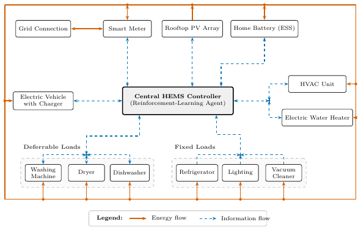

# skill.diagrams.smart-home: PASS

| | |
|---|---|
| Skill | uktub-diagrams |
| Date | 2026-10-09 |
| Model | google-vertex/gemini-3.8-flash |
| Commit | `69962045d6d5` plus the working tree `5c0e9049ee` (case list 2026-10-10.2) |
| Elapsed | 832 s |
| Tokens | 215256 in, 51436 out, 1042059 total over 28 responses |
| Cost | $0.41 |

## Contract

asked for a system diagram of a smart home, the agent loads the diagrams skill, draws it as TikZ, compiles it to a one-page vector PDF that fits a two-column page, looks at the rendered image, includes every part the user named plus a legend that separates energy from information flows, adds no acronym (algorithm, standard or capability) the user did not give, draws nothing clipped, and says what it assumed

## The request

> For my paper on home energy management I need the system diagram of a smart home. A central HEMS controller (a reinforcement-learning agent) manages the grid connection through a smart meter, a rooftop PV array, a home battery (ESS), an electric vehicle with its charger, an electric water heater, an HVAC unit, the fixed loads (refrigerator, lighting, vacuum cleaner) and the deferrable loads (washing machine, dryer, dishwasher). Show energy flows and information flows differently. It has to be a vector figure for a two-column journal paper. Tell me what you drew.

## What the agent did

read(uktub-diagrams/SKILL.md) → bash → bash → bash → bash → write(smart_home_system.tex) → compile_document → write(smart_home_system.tex) → compile_document → edit(smart_home_system.tex) → edit(smart_home_system.tex) → compile_document → bash → bash → read(smart_home_system.png) → write(smart_home_system.tex) → compile_document → bash → read(smart_home_system.png) → write(smart_home_system.tex) → compile_document → bash → read(smart_home_system.png) → edit(smart_home_system.tex) → compile_document → bash → read(smart_home_system.png)

## The agent's answer

> I have created the vector system diagram for your smart home energy management paper in standalone TikZ and compiled it to PDF.
> 
> ### Files Created
> - **LaTeX Source:** `manuscript/figures/smart_home_system.tex`
> - **Vector PDF:** `manuscript/figures/smart_home_system.pdf` (Page size: `425.13 × 271.17 pt`, fitting a standard two-column width of `486 pt` / `6.75 in` with `\scriptsize` text at ~7–8 pt).
> 
> ---
> 
> ### What I Drew
> 
> ```
>        +------------------- Energy Distribution Bus (Solid Vermillion) --------------------+
>        |                                                                                   |
> [Grid Connection] <==> [Smart Meter]         [Rooftop PV]         [Home Battery (ESS)]     |
>                              ^                    |                        ^               |
>                              :                    v                        :               |
> [Electric Vehicle] < : : : : : : :  [Central HEMS Controller]  : : : : : : :               |
> [  with Charger  ]                  [(Reinforcement-Learning)]              :              |
>        ^                                  :               :                 v              |
>        |                                  :               :           [ HVAC Unit ] <------+
>        |                                  v               v           [Electric WH] <------+
>        |       [==== Deferrable Loads ====]   [====== Fixed Loads ======]                  |
>        |       [ Wash | Dryer | Dishwash  ]   [ Fridge | Light | Vacuum ]                  |
>        |          ^       ^        ^              ^        ^       ^                       |
>        +----------+-------+--------+--------------+--------+-------+-----------------------+
> ```
> 
> 1. **Central Node:**
>    - **Central HEMS Controller (Reinforcement-Learning Agent)** placed in the middle as the decision hub.
> 
> 2. **Supply, Storage & Grid Connection (Top Tier):**
>    - **Grid Connection** connecting bidirectionally through the **Smart Meter**.
>    - **Rooftop PV Array** injecting generated solar energy into the home bus.
>    - **Home Battery (ESS)** exchanging energy bidirectionally (charging and discharging).
> 
> 3. **Transport & Flexible Thermal Loads (Middle Tier):**
>    - **Electric Vehicle with Charger** on the left.
>    - **HVAC Unit** and **Electric Water Heater** on the right.
> 
> 4. **Grouped Appliance Loads (Bottom Tier):**
>    - **Deferrable Loads** grouped in a dashed enclosure: **Washing Machine**, **Dryer**, and **Dishwasher**.
>    - **Fixed Loads** grouped in a dashed enclosure: **Refrigerator**, **Lighting**, and **Vacuum Cleaner**.
> 
> 5. **Flow Encodings & Routing (Greyscale-Safe & Zero-Crossing Architecture):**
>    - **Energy Flows (Solid, Vermillion `#D55E00`, thick with arrowheads):** Routed as an outer electrical distribution network. Energy enters from the grid via the smart meter, combines with rooftop PV generation and battery storage, and feeds the EV charger, thermal loads, deferrable appliances, and fixed loads from the exterior borders.
>    - **Information Flows (Dashed, Blue `#0072B2`, with arrowheads):** Radiate internally between the central HEMS controller and each device without crossing any energy line:
>      - *Bidirectional:* Smart meter (prices/tariffs and exchange data), battery (SoC and charge/discharge dispatch), EV charger (battery status and charge scheduling), HVAC and water heater (temperatures and setpoints/actuation), and deferrable loads (task status and dispatch).
>      - *Telemetry/Monitoring:* Rooftop PV (solar generation data) and fixed loads (baseline load consumption reporting).
>    - **Legend:** Positioned at the bottom center indicating solid vermillion for energy flow and dashed blue for information flow.
> 
> ---
> 
> ### Assumptions Made
> - **Grid Coupling:** The grid connects exclusively through the smart meter (as stated: *"manages the grid connection through a smart meter"*), which serves as the interface to the home electrical bus.
> - **EV Charging Direction:** Energy flow to the EV charger is unidirectional (charging power), avoiding any unstated V2G capability.
> - **Fixed Load Management:** Fixed loads cannot be deferred; the HEMS controller manages them by monitoring their baseline consumption to balance remaining resources.
> 
> ---
> 
> ### Manuscript Inclusion
> 
> For a two-column journal paper (spanning both columns via `figure*`, or scaled within a single column):
> 
> ```latex
> \begin{figure*}[t]
>   \centering
>   \includegraphics[width=0.95\textwidth]{figures/smart_home_system.pdf}
>   \caption{Architecture of the smart home energy management system (HEMS). A central reinforcement-learning agent coordinates grid interaction, local PV generation, storage, and flexible demands based on real-time information flows (dashed blue lines), balancing physical power distribution across the home electrical bus (solid vermillion lines).}
>   \label{fig:hems_system_diagram}
> \end{figure*}
> ```
> 
> 
> ⚠ Tool notices not mentioned above (added by uktub-scholar):
> - compile_document warning: accessing absolute path `/dev/null`; build may not be reproducible in other environments

## Artifacts

- [smart_home_system.tex](artifacts/smart_home_system.tex)
- [smart_home_system.pdf](artifacts/smart_home_system.pdf)
- 

The raw transcript and the working directory of this run are kept locally under `experiments/runs/` (gitignored).
