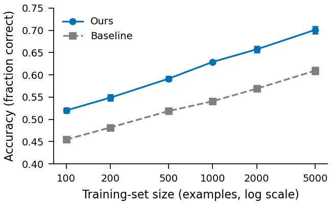

# skill.figures.plot-user-data: PASS

| | |
|---|---|
| Skill | uktub-figures |
| Date | 2026-10-09 |
| Model | google-vertex/gemini-3.8-flash |
| Commit | `69962045d6d5` plus the working tree `ea6bd36ad3` (case list 2026-10-10.1) |
| Elapsed | 260 s |
| Tokens | 74210 in, 11461 out, 369722 total over 24 responses |
| Cost | $0.12 |

## Contract

asked for a paper figure from the user's CSV, the agent loads the figures skill, builds the figure from the file (every plotted value equals the data), saves a vector PDF with its script beside it, looks at the rendered image, and reports where the figure is and what it shows

## The request

> My results are in data/accuracy.csv: accuracy of two methods against training-set size, three seeds each. Make a figure for my paper from it showing how the two methods scale, save it where my LaTeX manuscript can include it, and tell me what you made.

## What the agent did

read(uktub-figures/SKILL.md) → bash → read(accuracy.csv) → bash → bash → read(figstyle.py) → bash → bash → read(chunking.yaml) → bash → write(scaling.py) → bash → edit(scaling.py) → bash → read(accuracy_scaling.png) → read(accuracy_scaling.plotdata.json) → edit(scaling.py) → bash → read(accuracy_scaling.png) → edit(scaling.py) → bash → read(accuracy_scaling.png) → read(accuracy_scaling.plotdata.json)

## The agent's answer

> I have generated publication-ready vector and preview figures from `data/accuracy.csv`.
> 
> ### Output Files
> - **Plotting script**: `manuscript/figures/scaling.py`
> - **Style helper**: `manuscript/figures/figstyle.py`
> - **Vector PDF for manuscript**: `manuscript/figures/accuracy_scaling.pdf` (3.25 in column width, TrueType fonts embedded)
> - **Raster preview**: `manuscript/figures/accuracy_scaling.png`
> - **Plotted data log**: `manuscript/figures/accuracy_scaling.plotdata.json`
> 
> ### Summary of What Was Made
> - **The Finding**: The proposed method consistently outperforms the baseline across all training-set sizes from 100 to 5,000 examples (accuracy advantage of 6.5 percentage points at 100 examples up to 9.2 percentage points at 5,000 examples), achieving comparable accuracy with roughly $5\times$ fewer training examples (e.g., 0.520 at $N=100$ vs. 0.519 for baseline at $N=500$; 0.629 at $N=1{,}000$ vs. 0.609 for baseline at $N=5{,}000$).
> - **Visual Design**:
>   - Sized for a single column at print width (`COLUMN` = 3.25 in) with unscaled typography.
>   - Logarithmic x-axis (`examples, log scale`) spanning 100 to 5,000.
>   - Distinguishable in greyscale and color-blind safe: Baseline in `GREY` with dashed lines and square markers; Ours in Okabe–Ito blue with solid lines and circular markers.
>   - Error bars show $\pm 1$ standard deviation across the 3 seeds ($n=3$).
>   - Clean legend ordered to match curve positions; axes title omitted in favor of the LaTeX caption.
> 
> ### LaTeX Inclusion Snippet
> 
> ```latex
> \begin{figure}[t]
>   \centering
>   \includegraphics[width=\linewidth]{figures/accuracy_scaling.pdf}
>   \caption{\textbf{The proposed method outperforms the baseline across all training-set sizes and achieves matching accuracy with approximately $5\times$ fewer examples.} Accuracy (fraction correct) as a function of training-set size (log scale) for Baseline and Ours; markers denote the mean of 3 seeds ($n=3$), and error bars denote one standard deviation. Accuracy axis is truncated to $[0.40, 0.75]$.}
>   \label{fig:accuracy_scaling}
> \end{figure}
> ```

## Artifacts

- [accuracy.csv](artifacts/accuracy.csv)
- [accuracy_scaling.pdf](artifacts/accuracy_scaling.pdf)
- [accuracy_scaling.plotdata.json](artifacts/accuracy_scaling.plotdata.json)
- 
- [figstyle.py](artifacts/figstyle.py)
- [scaling.py](artifacts/scaling.py)

The raw transcript and the working directory of this run are kept locally under `experiments/runs/` (gitignored).
