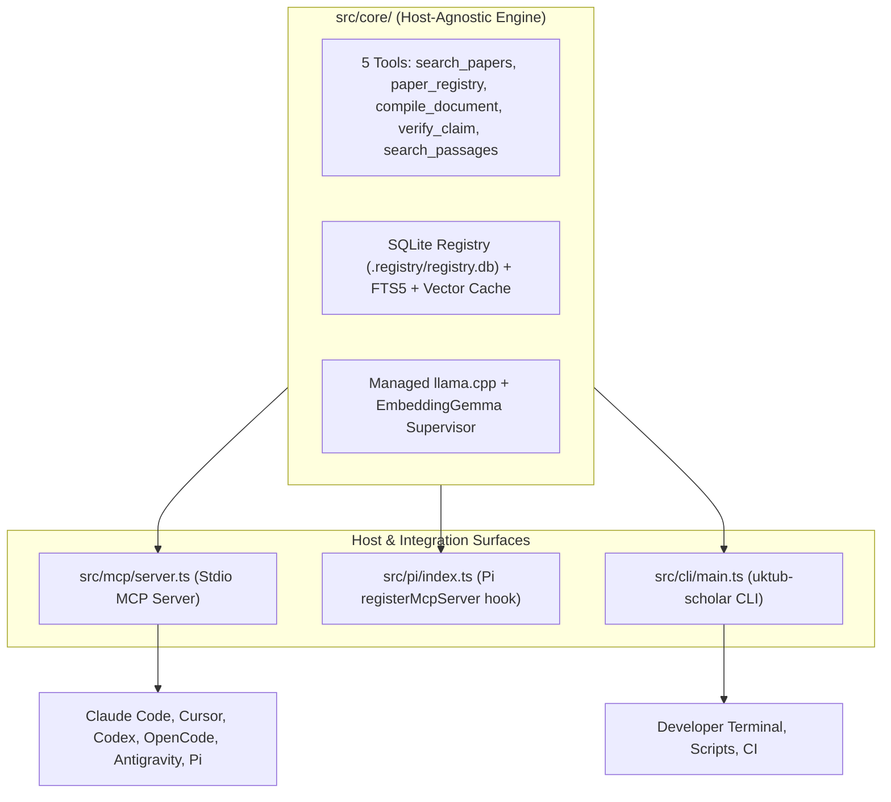

# Independent Reviewer Handoff & Stress-Test Protocol (v0.2.0)

> [!WARNING] **Reviewer Stance & Skepticism Disclaimer**
> You are an independent reviewer whose goal is to verify, challenge, and stress-test this codebase. Do not assume anything works because of previous claims, documentation, or commit messages. Approach every subsystem with rigorous skepticism: write reproducer probes, run live zero-mock integrations, attack edge cases, and inspect raw output bytes. If something breaks or deviates from its documented contract, write a test-first reproduction and fix it before finishing.

---

## 1. System Overview & Architecture (v0.2.0)

`Uktub-scholar` is a local-first scholarly tools suite for coding agents and researchers. It provides five canonical capabilities:
1. `search_papers`: Live paper search across OpenAlex, Crossref, and Semantic Scholar with Reciprocal Rank Fusion (RRF).
2. `paper_registry`: Unified registry managing papers, citekeys, metadata, local PDF/TEI source attachments, and one-way BibTeX bibliography sync (`refs/references.bib`).
3. `compile_document`: LaTeX compilation with local Tectonic, structured diagnostic parsing, and PDF generation into `build/`.
4. `verify_claim`: One-claim verification against registered papers, powered by a local resident Decision 2.0 Eos 0.8B model (CUDA) or OpenRouter fallback, producing exact text pointers (`doi@revision#start-end`) and strict full-text containment.
5. `search_passages`: Exploratory hybrid RAG passage search combining SQLite FTS5 (BM25) and exact-cosine dense vector search over document sections.

### Host Integration Surfaces


---

## 2. Reviewer Ground Rules & Protocol

### A. Zero Mocks on Integration Paths
Unit tests use offline provider fakes for isolation and determinism. **However, your review must validate against the real world:**
- Real OS processes and stdio pipes (`StdioClientTransport`, child processes).
- Real scientific PDFs (14 test papers in `../test_papers`).
- Real live APIs (OpenAlex, Crossref, Semantic Scholar, OpenAlex Content API).
- Real binaries (`llama-server`, `tectonic`, `python3` with PyTorch/CUDA).
- Real filesystem interactions, SQLite locks, and schema migrations.

### B. Test-First Bug Fixes (TDD)
If you identify any defect, race condition, data truncation, or missing handling:
1. Write a failing regression test or isolated reproduction script first.
2. Verify that it reproduces the bug cleanly.
3. Apply the minimal, robust fix to the codebase.
4. Verify that the regression test now passes, alongside every existing test (`pnpm test`).
5. **Never weaken or skip existing tests.**

### C. External Research via Hermes Subagents
Whenever you need to verify external specifications, package versions, upstream bug reports, or host configurations, delegate to the Hermes research subagent:
- **Skill reference:** `.agents/skills/hermes-subagent/SKILL.md`
- **Invocation pattern:** Instruct Hermes as an online research subagent for external standards and packages without touching local files:
  - *Example 1 (MCP Specification)*: "Check the Model Context Protocol stdio transport specification and standard JSON-RPC 2.0 error response shapes for unknown tools and validation errors."
  - *Example 2 (Host Configuration Formats)*: "Verify the current configuration schema for MCP servers in Claude Code (`.mcp.json`), Cursor (`.cursor/mcp.json`), Codex (`.codex/config.toml`), and OpenCode (`opencode.json`)."
  - *Example 3 (llama.cpp & GGUF)*: "Verify the release assets and SHA-256 conventions for llama.cpp release b11398, and verify Google's embeddinggemma-300m architecture tensor names (`dense_2.weight`, `dense_3.weight`)."
  - *Example 4 (OpenAlex Content API)*: "Research the OpenAlex Content API TEI XML schema, specifically how root XML nodes and direct `<div>` paragraphs are formatted."
- **Strict Guardrail:** Hermes subagents are research-only and must never edit or create local workspace files. All implementation and verification remains local.

---

## 3. Subsystem Stress-Test Suites

The reviewer must execute the following 10 stress-test suites and document exact PASS / FAIL / NOT RUN status and metrics.

### Subsystem 1: Baseline Verification & Clean Architecture
- **Goal:** Verify typecheck, import boundaries, and zero-defect baseline.
- **Commands:**
  ```sh
  pnpm exec tsc --noEmit --noUnusedLocals --noUnusedParameters
  pnpm test
  ```
- **Validation Criteria:**
  - `tsc` exits 0 with zero errors and zero unused variables.
  - All tests pass (2 skipped by design: env-gated Julia engine); counts are recorded once, in `docs/review-2026-10-05.md`.
  - `tests/import-allowlist.spec.ts` passes: `src/core/`, `src/cli/`, and `src/mcp/` have zero imports of `@earendil-works/pi-coding-agent`.

### Subsystem 2: Unified Stdio MCP Server (JSON-RPC Protocol & Transports)
- **Goal:** Stress-test the stdio MCP server across in-memory and real OS subprocess transports.
- **Key Files:** `src/mcp/server.ts`, `tests/mcp-server.spec.ts`.
- **Stress-Test Scenarios:**
  1. **Tool Listing & Schemas:**
     - Initialize MCP client over `StdioClientTransport` pointing to `bin/uktub-scholar.js mcp`.
     - Call `tools/list`: verify all 5 tools (`search_papers`, `paper_registry`, `compile_document`, `verify_claim`, `search_passages`) return valid JSON Schema properties and descriptions.
  2. **Tool Execution:**
     - Execute each of the 5 tools via `tools/call`.
     - Verify structured content envelopes (`content`, `isError`, `structuredContent`).
  3. **Tool Namespacing Normalization:**
     - Test calling tools with bare names: `search_papers`.
     - Test calling tools with Claude Code prefixes: `mcp__uktub_scholar__search_papers`.
     - Test calling tools with slash namespaces: `uktub-scholar/search_papers`.
     - Test colon namespaces: `mcp__uktub-scholar:search_papers`.
     - Verify `normalizeToolName()` strips prefixes correctly and routes to the real tool.
  4. **Error Handling & Refusals:**
     - Pass invalid arguments (e.g. unknown action to `paper_registry`, empty claim to `verify_claim`).
     - Verify responses return `isError: true` with stable refusal messages (`Refused: CODE — message. Next: hint.`).

### Subsystem 3: Declarative Host Configuration Generator (`mcp install`)
- **Goal:** Verify that `uktub-scholar mcp install` correctly provisions config files for all target agent hosts without data corruption.
- **Command Matrix:**
  ```sh
  pnpm exec uktub-scholar mcp install --host claude     # writes .mcp.json
  pnpm exec uktub-scholar mcp install --host pi         # writes .mcp.json
  pnpm exec uktub-scholar mcp install --host cursor     # writes .cursor/mcp.json
  pnpm exec uktub-scholar mcp install --host codex      # writes .codex/config.toml
  pnpm exec uktub-scholar mcp install --host opencode   # writes opencode.json
  pnpm exec uktub-scholar mcp install --host agy        # writes .agents/mcp_config.json
  ```
- **Stress-Test Scenarios:**
  1. **Clean Installation:** Run against an empty temporary directory; verify valid JSON/TOML syntax.
  2. **Preservation & Merging:** Run against a pre-existing config containing existing servers (e.g. `weather-server`, `fetch`); verify existing servers are preserved and `uktub-scholar` is merged.
  3. **Idempotence:** Re-running install on an already configured host must produce identical output without duplicate entries.
  4. **Invalid Host Handling:** Pass `--host invalid`; verify typed refusal naming allowed hosts.

### Subsystem 4: Path Confinement & Sandbox Security (`PATH_REFUSED`)
- **Goal:** Prove that the agent host cannot escape project boundaries or corrupt protected state.
- **Key Files:** `src/core/tools/context.ts`, `src/mcp/server.ts`, `tests/tools.spec.ts`, `tests/source-preparation.spec.ts`, `tests/mcp-server.spec.ts`.
- **Stress-Test Scenarios:**
  1. **Directory Traversal:**
     - Attempt `attach_source` `path` values and `mcp --dir` containing `../`, `../../etc`, `..\\windows`.
     - Verify rejection with `PATH_REFUSED` before filesystem access occurs.
  2. **Protected Segments:**
     - Attempt reading or writing `.registry/` or `.git/`.
     - Verify immediate rejection (`tool context points at the protected path segment`).
  3. **Symlink Escapes:**
     - Create a symlink inside the project pointing outside the project root; call `attach_source`.
     - Verify detection and refusal.
  4. **SSRF Defense:**
     - In `src/core/source/download.ts`, verify blocking of private IP ranges:
       - Loopback: `127.0.0.1`, `::1`
       - RFC1918: `10.0.0.0/8`, `172.16.0.0/12`, `192.168.0.0/16`
       - Cloud metadata: `169.254.169.254`
       - IPv6 ULA, IPv4-mapped, and redirect hops.

### Subsystem 5: Real Paper Search & Multi-Provider Degradation
- **Goal:** Validate live scholarly search across OpenAlex, Crossref, and Semantic Scholar.
- **Script:** `scripts/test-live-search.ts`
- **Stress-Test Queries:**
  - DOI-shaped: `10.1038/s41586-020-2649-2` (*Array programming with NumPy*) — `search_papers` is free-text by contract ("a DOI-shaped query still searches"); exact resolution is `paper_registry register`, so expect a hint, not that paper
  - arXiv ID: `2411.09996` (Wireless Foundation Model) — same: register it, do not expect search to resolve it
  - Misspelled query: `attenshun is all you ned` — typo tolerance was **not met** on 2026-10-05 (OpenAlex/Crossref do not correct typos; S2 rate-limits without a key); record what you observe
  - Multilingual queries: Arabic (`معالجة اللغات الطبيعية`), French (`apprentissage profond`)
  - Long natural language query (> 200 characters)
  - Nonsense query -> Expect 0 hits, `found: false` without exception
- **Degradation Testing:**
  - Block OpenAlex via network fake -> Verify Crossref and S2 continue with warning.
  - Block Semantic Scholar -> Verify OpenAlex and Crossref continue with warning.
  - Block all 3 providers -> Verify typed refusal `SEARCH_UNAVAILABLE`.

### Subsystem 6: Paper Registry & Document Extraction (GROBID TEI & PDF)
- **Goal:** Stress-test paper registration, citekey pinning, bibliography rendering, and live full-text extraction.
- **Scripts:** `scripts/test-live-registration.ts`, `scripts/test-live-tei.ts`
- **Stress-Test Scenarios:**
  1. **Batch Registration & Deduplication:**
     - Register 5 DOIs in a single batch.
     - Re-register the same papers using URL format (`https://doi.org/...`) -> Expect `duplicate` with preserved citekeys.
  2. **Bibliography Sync & Healing:**
     - Hand-edit `refs/references.bib` with invalid content.
     - Call `paper_registry(action: "sync_bibliography")` or CLI `uktub-scholar sync-bib`.
     - Verify byte-identical restoration from SQLite registry.
  3. **GROBID TEI Extraction:**
     - Test papers via OpenAlex Content API (e.g. DESeq2 `10.1186/s13059-014-0550-8`, PRISMA `W2156098321`).
     - Verify handling of wrapped HTML (`<html><body><tei>`), case-insensitive XML tags, and direct `<div>` text preservation (> 200 chars).
  4. **PDF Extraction:**
     - Run `scripts/test-item4-extraction.ts` on the 14 real papers in `../test_papers`.
     - Verify extraction time (average < 150 ms/document; the 14-page `2506.06718v2` takes ≈ 225 ms).
     - Test hostile PDFs: missing `%PDF-` header, truncated `%%EOF`, missing text layer (scanned).

### Subsystem 7: Section Chunking & Tiling Math
- **Goal:** Prove mathematical continuity of document chunking.
- **Key Files:** `src/core/sections.ts`, `tests/sections.spec.ts`, `scripts/test-item4-extraction.ts`.
- **Verification Invariants:**
  - Default policy: `boundary: section`, 512 tokens.
  - **Zero gaps:** For all chunks $i$, `chunks[i].char_end === chunks[i+1].char_start`.
  - **Zero overlaps:** `chunks[0].char_start === 0` and `chunks[last].char_end === fullText.length`.
  - **Verbatim reconstruction:** `chunk.text === fullText.slice(chunk.char_start, chunk.char_end)`.
  - **Heading integrity:** Section headings are never chopped or isolated at the trailing edge of a chunk; section labels are capped at 200 characters.

### Subsystem 8: Embedding GGUF Parity & First-Party Resolution
- **Goal:** Verify that the served embedding GGUF model reproduces the reference sentence-transformers geometry.
- **Key Files:** `scripts/embed-parity.py`, `src/core/embed/models.lock.json`.
- **Verification Steps:**
  1. Check `src/core/embed/models.lock.json`:
     - Pinned model: `ggml-org/embeddinggemma-300M-GGUF` (`embeddinggemma-300M-Q8_0.gguf`).
     - Sha256: `b5ce9d77a3fc4b3b39ccb5643c36777911cc4eb46a66962eadfa3f5f60490d63`.
     - Size: 333,590,944 bytes.
  2. Run the parity gate:
     ```sh
     python3 scripts/embed-parity.py http://127.0.0.1:8080
     ```
  3. Verify thresholds:
     - Mean cosine similarity: $\ge 0.98$ (expected: **0.9997**).
     - Pairwise Pearson correlation: $\ge 0.99$ (expected: **0.9999**).
     - Top-1 retrieval agreement: **1.00**.
  4. Negative control: Verify that defective 314-tensor GGUF (`embeddinggemma-300m-qat-q8_0-GGUF` lacking dense modules) fails the gate (cosine $\approx 0.01$).

### Subsystem 9: Managed llama.cpp Supervisor & Hybrid RAG Retrieval
- **Goal:** Verify child process supervision, cold indexing, crash recovery, and hybrid search.
- **Scripts:** `scripts/bench-rag.ts`, `scripts/test-item5-rag-lifecycle.ts`.
- **Stress-Test Scenarios:**
  1. **Supervisor Process Lifecycle:**
     - Verify `embed install --yes` unpacks verified binary and GGUF into `UKTUB_CACHE_DIR`.
     - Verify `search_passages` starts `llama-server` on loopback.
     - Send `SIGKILL` to `llama-server` mid-session; verify supervisor auto-restarts the child process and answers subsequent queries.
     - Send `SIGTERM` / `SIGINT` / `SIGHUP` to the parent process; verify child `llama-server` is actively killed (no zombie/orphaned processes). `SIGKILL` of the parent cannot be handled and leaves the child running (known limitation, BACKLOG §5).
  2. **Hybrid RAG Fusion (BM25 + Cosine RRF k=60):**
     - Run 30 domain queries across Smart Home and RF sensing papers.
     - Verify 100% pointer resolution (`doi@revision#start-end`).
  3. **Full-Text Output Containment:**
     - Enforce `SOURCE_SHARE_MAX = 0.25` (max 25% of any paper's text released per call).
     - Enforce 1,500 characters per passage excerpt.
     - Verify that queries targeting a single paper withhold excess text with `withheld: "source_share"`, while retaining all exact pointers.

### Subsystem 10: Resident CUDA Decision 2.0 Eos Claim Verification
- **Goal:** Verify the primary claim verification engine on CUDA GPU.
- **Key Files:** `scripts/decision2_decide.py`, `scripts/test-item7-claim-verification.ts`.
- **Stress-Test Scenarios:**
  1. **Engine Startup & Identity:**
     - Starts `scripts/decision2_decide.py` using Python environment (`UKTUB_EOS_PYTHON`).
     - Handshake check: returns `{"ready": true, "model": "...", "revision": "..."}` on first line.
     - Memory footprint: $\approx 2\text{ GB}$ on CUDA GPU (1,925 MiB after load on an RTX 4060).
  2. **Verification Quality (Bar 0.99):**
     - `scripts/test-item7-claim-verification.ts` samples 42 TRUE and 42 FALSE claims (3 per paper × 14 papers): target recall $\ge 90\%$ (measured 2026-10-05: 90.5%, 38/42).
     - FALSE / altered claims: target specificity $\ge 95\%$ (measured: 95.2%, 40/42).
     - Verify precision $\ge 95\%$ (measured: 95.0%). Margins are thin; the run is deterministic.
  3. **Continuation & Paging:**
     - Test multi-page evidence output: verify continuation token resumes unfinished checking without re-judging cached passages.
     - Verify pointer integrity across pages.

---

## 4. Deliverables & Required Reporting Format

The reviewer must deliver their final report as a structured Markdown document (or pull request review) matching the following format:

```markdown
# Independent System Review: Uktub-scholar v0.2.0

**Date:** YYYY-MM-DD
**Reviewer:** [Independent Reviewer Name]
**Target:** `Uktub-scholar` repository
**Baseline Commit:** [Commit SHA]

## Executive Summary
[Brief overview of findings, bugs discovered, fixes applied, and pass/fail summary.]

## Review Matrix (10 Subsystems)
| # | Subsystem | Status (PASS/FAIL/NOT RUN) | Key Evidence / Metric |
|---|---|---|---|
| 1 | Baseline Test Suite & Typecheck | | |
| 2 | Unified Stdio MCP Server | | |
| 3 | Declarative Host Config Generator | | |
| 4 | Path Confinement & Sandbox Security | | |
| 5 | Real Paper Search & Degradation | | |
| 6 | Paper Registry & TEI/PDF Extraction | | |
| 7 | Section Chunking & Tiling Math | | |
| 8 | Embedding GGUF Parity Gate | | |
| 9 | Managed llama.cpp & Hybrid RAG | | |
| 10 | Resident CUDA Eos Claim Verification | | |

## Detailed Evidence & Logs
[Item-by-item breakdown with exact command invocations, timings, and outputs.]

## Bugs Discovered & TDD Fixes
[Details on any bugs found, the failing test written, and the code diff that resolved it.]

## Known Limitations & Next Steps
[Honest assessment of residual risks and future roadmap items.]
```
