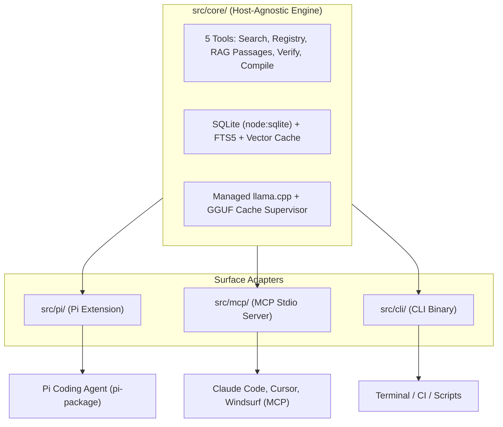

# Package Installation, Distribution & Multi-Host Handoff

## 1. Context & Objective

The `Uktub-scholar` package is currently verified and functioning as an independent, local-first scholarly tools suite. It provides:
- Live paper search across OpenAlex, Crossref, and Semantic Scholar with RRF candidate fusion.
- Unified paper registry with local PDF/TEI attachment, metadata extraction, and BibTeX synchronization.
- Section-aware chunking (512 tokens) with exact character-slice recovery and zero tiling gaps.
- Managed `llama.cpp` (`b11398`) embedding supervisor running first-party `ggml-org/embeddinggemma-300M-GGUF` (0.9997 cosine parity against reference `sentence-transformers`).
- Exploratory RAG passage search (`search_passages`) with FTS5 lexical + vector RRF hybrid retrieval and strict full-text containment.
- Claim verification (`verify_claim`) backed by a resident Decision 2.0 Eos 0.8B model running locally on CUDA GPU (or OpenRouter fallback).
- LaTeX compilation (`compile_document`) via local Tectonic binary.

The primary objective now is **packaging, distribution, and universal installation** so that `uktub-scholar` functions seamlessly as:
1. A **Pi package / extension** for the Pi Coding Agent (`@earendil-works/pi-coding-agent`).
2. An **MCP server** for **Claude Code**, Cursor, Windsurf, Antigravity, and other Model Context Protocol clients.
3. A **Standalone CLI** for developers, scripts, and CI workflows.

---

## 2. Packagability & Portability Audit: Current State vs. Universal Needs

### A. What Can Be Packaged Cleanly (Host-Independent)
- **`src/core/`**: 100% host-agnostic TypeScript. Relies only on standard Node.js built-ins (`node:sqlite`, `node:fs`, `node:crypto`, `node:child_process`, `fetch`). SQLite schema migrations, FTS5 BM25 search, vector embeddings, citation handling, and extraction logic have zero host dependencies.
- **`skills/uktub-research/SKILL.md`**: Host-agnostic procedural guidance teaching any AI coding agent when and how to call the 5 tools.
- **`src/cli/`**: Standalone command-line interface.
- **Managed Assets**: `llama-server` binary and the 318MB GGUF are downloaded on-demand into `UKTUB_CACHE_DIR` (or `~/.cache/uktub-scholar/`) via `embed install --yes`. They are not bundled into the npm package, keeping the package size minimal (< 5 MB).

### B. What Violates Packagability Today
1. **Hard Peer Dependency on Pi (`package.json`)**:
   - `package.json` specifies `"peerDependencies": { "@earendil-works/pi-coding-agent": "*", "typebox": "*" }`.
   - Claude Code / npm users who run `npm install -g uktub-scholar` or `npx uktub-scholar` receive installation errors or warnings about missing Pi packages.
2. **Missing MCP Adapter**:
   - Claude Code and other modern agents cannot execute Pi extension code (`pi.registerTool`, `pi.on`). They communicate exclusively over **MCP (Model Context Protocol)** using JSON-RPC over `stdio`.
3. **No Compiled Distribution Pipeline (`dist/`)**:
   - `"private": true` is set in `package.json`, preventing npm publication.
   - There is no `dist/` directory or `build` script. `bin/uktub-scholar.js` invokes `src/cli/main.ts` using `node --experimental-strip-types`. While functional in local Node 22/23 development, standard npm consumers expect pre-compiled `.js` and `.d.ts` artifacts.
4. **Host Guard Asymmetry**:
   - In Pi, `pi.on("tool_call")` (`guardToolCall`) intercepts other tools (`bash`, `write_file`) from tampering with `.registry` or writing directly to `refs/`.
   - In Claude Code / MCP, the server is an external process; **it cannot intercept Claude's built-in file or bash operations**. The contract on non-Pi hosts is enforced at the tool API level and documented in agent instructions, not by host event interception.

---

## 3. Universal Architecture Design



---

## 4. Implementation Plan & Next Steps

### Phase 1: Decouple Peer Dependencies & Refactor Package Manifest
- In `package.json`:
  - Mark `@earendil-works/pi-coding-agent` as an optional peer dependency:
    ```json
    "peerDependencies": {
      "@earendil-works/pi-coding-agent": ">=1.0.0",
      "typebox": "^1.3.0"
    },
    "peerDependenciesMeta": {
      "@earendil-works/pi-coding-agent": {
        "optional": true
      }
    }
    ```
  - Declare dual binaries:
    ```json
    "bin": {
      "uktub-scholar": "./dist/cli/main.js",
      "uktub-scholar-mcp": "./dist/mcp/main.js"
    }
    ```
  - Define package exports:
    ```json
    "exports": {
      ".": "./dist/core/index.js",
      "./pi": "./dist/pi/index.js",
      "./mcp": "./dist/mcp/index.js"
    }
    ```

### Phase 2: Implement the MCP Adapter (`src/mcp/`)
- Create `src/mcp/main.ts`:
  - Use `@modelcontextprotocol/sdk` (or lightweight JSON-RPC over `node:readline` / `process.stdin`).
  - Translate the 5 tool definitions (`search_papers`, `paper_registry`, `compile_document`, `verify_claim`, `search_passages`) to MCP `tools/list` and `tools/call`.
  - Convert TypeBox parameter schemas to standard JSON Schema.
  - Instantiate `ToolContext` using current working directory (`process.cwd()`) and execute the exact same tool handlers in `src/core/tools/*`.
  - Map `ToolResult` outputs to MCP `content: [{ type: "text", text: ... }]` blocks, preserving error indicators on refusals.

### Phase 3: Add Production Build Pipeline (`dist/`)
- Configure a fast bundler (e.g. `tsup` or TypeScript project references via `tsc`):
  - Output compiled, sourcemapped, type-declared artifacts to `dist/`.
  - Add `"build": "tsup"` (or `"build": "tsc -p tsconfig.build.json"`) to `scripts`.
  - Add `"prepublishOnly": "pnpm run typecheck && pnpm test && pnpm run build"`.
  - Update `.gitignore` and `package.json` `"files": ["dist", "skills", "bin", "README.md", "LICENSE"]`.

### Phase 4: Verification & Host Integration Testing
- **Test with Pi**: Verify Pi local extension loading (`pi -e .`) and tool registration.
- **Test with Claude Code / MCP Inspector**:
  - Run MCP inspector: `npx @modelcontextprotocol/inspector node dist/mcp/main.js`.
  - Run Claude Code CLI configuration: `claude mcp add uktub-scholar -- node /path/to/Uktub-scholar/dist/mcp/main.js`.
  - Test tool discovery, execution of `search_papers`, `paper_registry`, `search_passages`, and `verify_claim`.
- **Test CLI**: Verify `uktub-scholar` executable runs cleanly without `--experimental-strip-types`.

---

## 5. Verification Status & Baseline

- **Current HEAD**: `de106a2`
- **Unit & Regression Tests**: 596 tests, 130 suites: **594 pass, 2 skipped** (Julia adapter env-gated).
- **Parity Gate**: 0.9997 cosine parity against `sentence-transformers` with official first-party `ggml-org/embeddinggemma-300M-GGUF`.
- **Clean Workspace**: `git status --short` is clean on `main`.

---

## 6. How to Resume

To continue from this handoff:
1. Review the proposed Phase 1 and Phase 2 changes.
2. Choose between using `@modelcontextprotocol/sdk` as a dependency vs. a zero-dependency JSON-RPC stdio implementation for `src/mcp/`.
3. Proceed with implementing `src/mcp/` and configuring the build toolchain.
