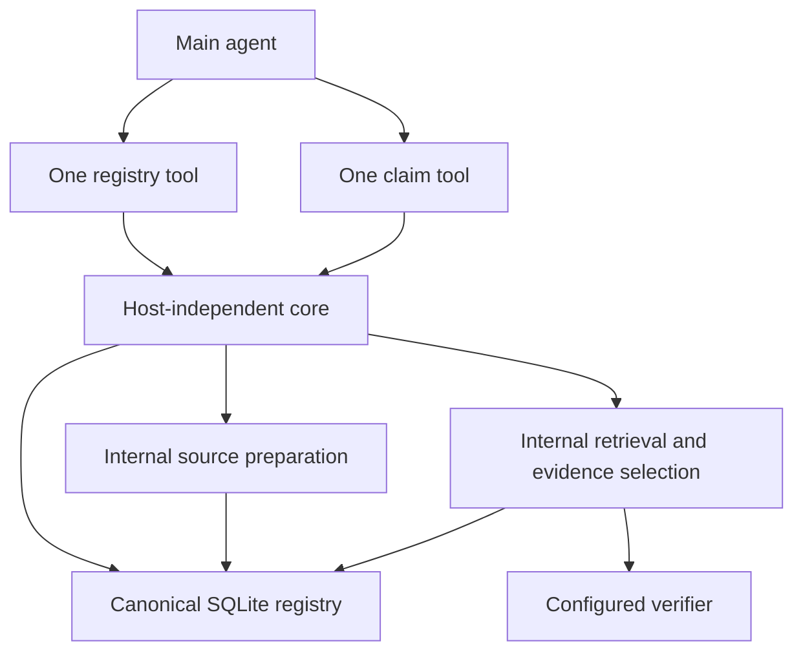
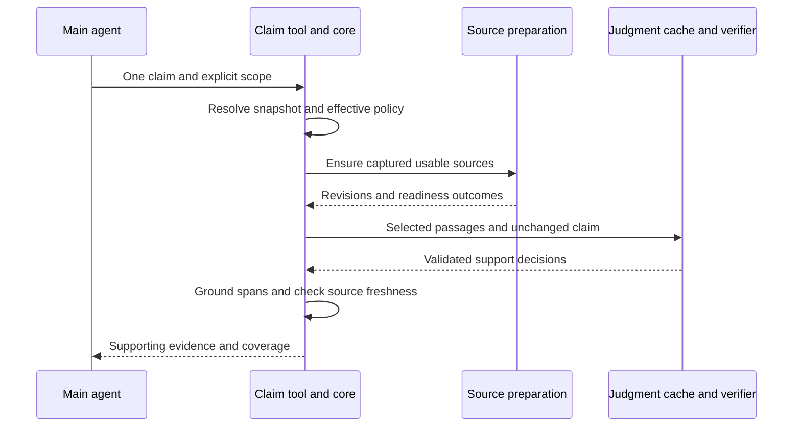
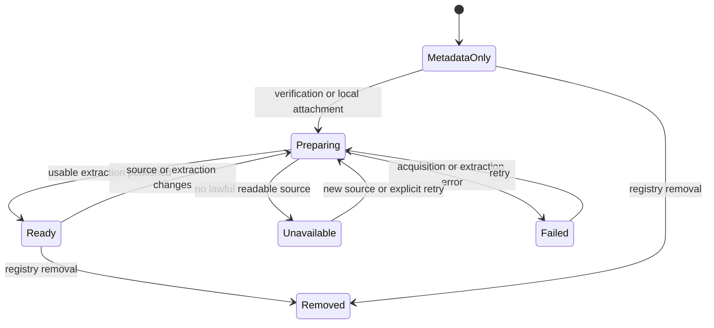
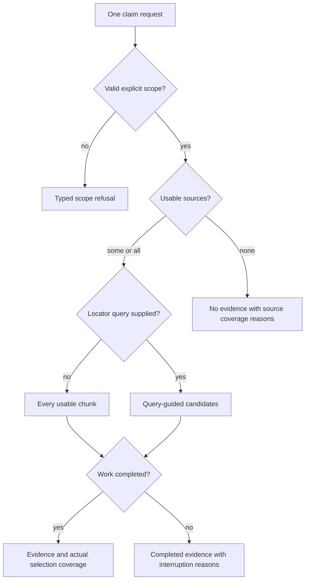
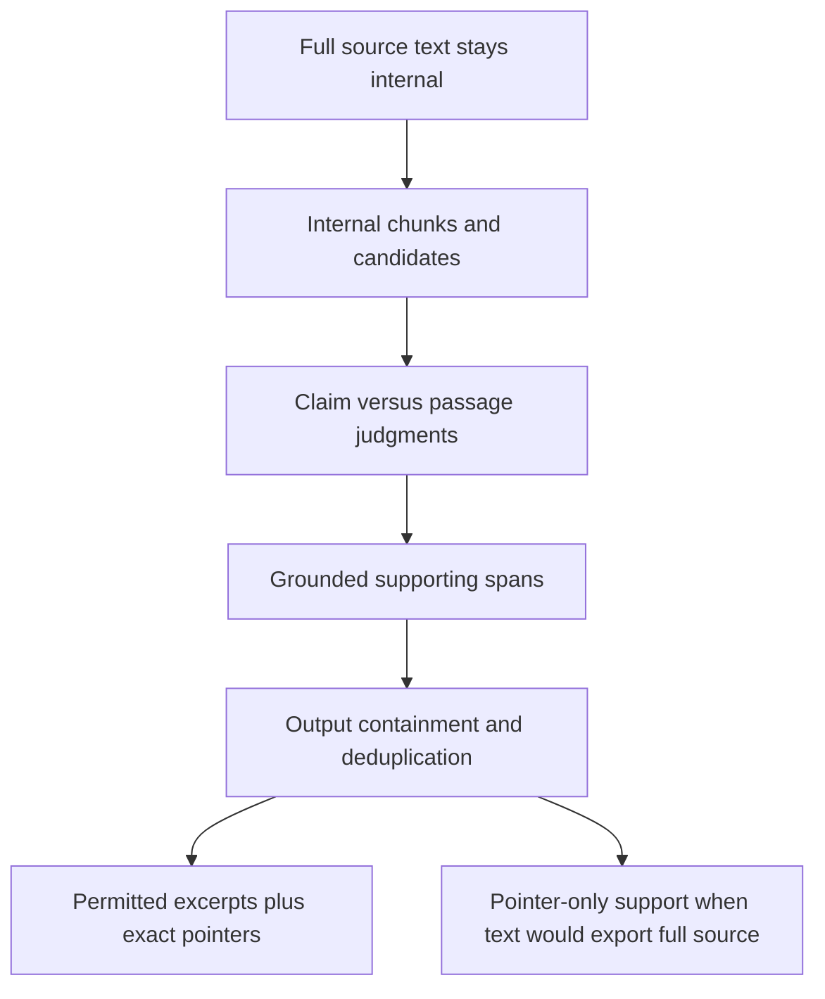

# Paper Registry and Supporting Evidence - Plan

**Target repository:** Uktub-scholar.

## Goal Capsule

- **Objective:** The main agent can manage its paper collection and obtain usable, source-grounded support for a claim without reading papers or preparing passages itself.
- **Means:** One registry tool and one claim-oriented evidence tool, with source preparation and retrieval inside the latter (KTD1–KTD3).
- **Authority:** Product Requirements govern behavior; Key Technical Decisions govern implementation within those requirements; units and examples do not override either.
- **Execution profile:** Implement and verify locally on `main`; no production changes, commit, push, paid provider calls, or deployment without separate authority.
- **Stop conditions:** A missing source, retrieval miss, or exhausted budget is an explicit coverage limitation, not permission to narrow the requested scope silently (R13–R15).
- **Ownership:** The implementer completes the units and evidence gates; the owner retains shipping and external-spend authority.

---

## Product Contract

### Summary

Replace separate paper-registration and listing tools with one complete paper-registry tool.
Replace claim-array verification with one-claim verification over all registered papers or an explicit paper subset.
Keep retrieval inside verification and return only supporting evidence records with exact source pointers.

### Problem Frame

Current registration already batches identifiers, but agents cannot remove papers, request projected fields, or traverse the complete registry through ordinary tools.
Verification assumes chunks were populated separately and returns scores and an index rather than usable evidence.
Making the main agent load papers would transfer parsing, chunk selection, and substantial text into the wrong context.

### Key Decisions

- **One registry tool rather than separate management tools.** The owner requested a complete batch-capable interface. Governs R1–R4. (session-settled: user-directed — chosen over separate register/list/remove tools: one coherent collection-management interface.)
- **No full-paper output to the main agent.** Summaries and supporting evidence are the permitted context. Governs R5–R6, R10. (session-settled: user-directed — chosen over agent-side paper loading: keep full-text processing internal.)
- **Technical mechanisms remain evidence-driven.** The owner authorizes technical decisions and implementation-time pivots, not implementation during planning. Governs R18.

### Requirements

**Registry management**

- R1. Expose one registry tool for batch registration, batch removal, projected reads, local-source attachment, and bibliography synchronization.
- R2. Resolve supported registration identifiers to canonical DOI identity, preserve pinned citekeys on refresh, and report an outcome for every input without guessing unknown identities.
- R3. Read selected allowed fields over all registered papers or an explicit DOI/citekey subset, with deterministic continuation that reaches every selected record.
- R4. Preserve per-paper registration commits and transactional batch removal, including the existing bibliography rollback/healing behavior; duplicate aliases cause one mutation and retain per-input outcomes.

**Context and source boundaries**

- R5. No package response surface returns full-paper text: text, structured content, details, errors, progress, or agent-visible diagnostics must obey the same boundary.
- R6. Registry reads may return bounded provider abstracts or available grounded summaries, with their kind and provenance; missing summaries are explicit and reads perform no hidden summarization calls.
- R7. Verification internally reuses, lawfully acquires, loads, extracts, and chunks sources as needed, without manual chunk preloading or a model-facing download tool.

**Claim evidence**

- R8. Verify exactly one claim against an explicit scope of all registered papers or an ID list; without a locator query, check every usable chunk of every selected paper unless a disclosed failure or work budget interrupts processing.
- R9. An optional query guides candidate selection only, never replaces the claim, and produces explicitly query-limited coverage rather than an exhaustive claim about the corpus.
- R10. Return only supporting evidence records, each with a verbatim supporting excerpt when permitted and an exact pointer; non-supporting candidate text must not reach the main agent.
- R11. Bind evidence to its actual paper, captured source/extraction revision, chunk identity, and excerpt span; source changes cannot silently repoint old evidence.
- R12. Provide a rare direct-passage path in the same verification tool, distinguishing registered source references from caller-supplied text with no authenticated paper provenance.
- R13. Distinguish no support found, unavailable sources, no retrieved candidates, interrupted work, and engine failure; low entailment scores or missing work do not establish scientific refutation.

**Reliability and completion**

- R14. Report source coverage, candidate coverage, completed verification work, and evidence-output truncation separately, including actionable per-paper failures and continuation where applicable.
- R15. Bound inputs, source processing, verification work, and agent output with documented provider/OS limits or explicitly labeled client policies, not unexplained constants.
- R16. Keep SQLite canonical, migrate known package schemas explicitly, preserve supported engines, and reuse judgments only under their effective decision identity and policy.
- R17. Cut over all affected core, Pi, CLI, guard, widget, test, and documentation consumers without obsolete public tools or claim-array aliases.
- R18. Establish behavior with substantial offline regression coverage, actual host/CLI smoke, and evidence-quality experiments; parsing, retrieval, chunking, and excerpt mechanisms may pivot while preserving R1–R17.

### Actors and Flows

- A1. Main agent: requests collection operations and claim support, consumes compact actionable results.
- A2. Technical human: supplies local files/configuration and manages project layout, credentials, and optional isolation.
- A3. Package core: owns canonical records, internal source processing, candidate selection, judgments, and provenance.

- F1. Register a batch, read selected fields, remove an explicit batch, and regenerate the derived bibliography when recovery is needed. Covers R1–R4.
- F2. Verify one claim over a registry snapshot, preparing sources internally and returning grounded support plus coverage. Covers R7–R11, R13–R16.
- F3. Repeat F2 with a locator query or direct passage, preserving the distinct guarantees of those paths. Covers R9, R12–R14.

### Acceptance Examples

- AE1. A batch containing a DOI URL, its normalized alias, a supported explicit arXiv identifier, and an invalid identifier produces ordered outcomes; aliases share canonical identity and invalid items do not undo valid registrations. Covers R2, R4.
- AE2. A registry larger than one output page can be traversed with a title/year/readiness projection; an explicit subset never expands to all and unavailable fields are not invented. Covers R3, R6, R14.
- AE3. Metadata registration followed by claim verification yields a reconstructable supporting passage without the agent reading a PDF or writing chunk rows. Covers R7–R8, R10–R11.
- AE4. An exhaustive run finds support that an irrelevant locator query misses; the query run reports its limited search, not a false claim verdict. Covers R9, R13–R14.
- AE5. Source replacement, model replacement behind a local endpoint, and paper removal cannot make an old pointer or cached judgment appear to refer to new evidence. Covers R11, R16.
- AE6. A single-chunk short paper and a paper whose many supported passages would collectively reproduce its body do not become full-text export paths. Covers R5, R10.

### Scope Boundaries

Included: project-local registry management, internal lawful source preparation, local-source attachment, supported-evidence retrieval/verification, and correctness repairs required for those flows.

Not included: a public exploratory retrieval tool, a new model selection exercise, a vector database service, generic metadata editing, global paper indexing, manuscript-wide review, a separate writer runtime, or migration of product infrastructure into this package.

Generated whole-paper summaries are not required merely because summaries are permitted.
A later summary-generation workflow needs an explicit consumer and cost contract.

R5 is a package tool-output contract, not a promise that an agent with host filesystem/bash access cannot independently read a user-owned PDF or SQLite database.
Preserve the package's advisory guards and opt-in sandboxing stance; stronger access isolation would require a separate owner decision.

---

## Planning Contract

### Current Repository Evidence

- `src/core/tools/register.ts` already resolves batches and commits items independently; reuse that path rather than create another registration convention.
- `src/core/registry.ts` owns DOI/citekey identity, removal, and bibliography rendering; `src/core/tools/list.ts` has a first-page cap but no usable continuation or subset projection.
- `src/core/scholarly.ts` supports DOI forms and explicit arXiv resolution; provider abstracts exist but registration currently discards them.
- `src/core/schema.sql` is version 2 and has chunks/cache/pointers, but no source-level revision, stored abstract, or retrieval index.
- `src/core/verify/claim.ts` returns probabilities, not evidence spans; production `src/core/verify/pipeline.ts` stores null quotes.
- `src/core/tools/verify.ts` constructs an engine before scope/cache checks, uses a multi-claim/single-DOI interface, and returns a maximum-score chunk index rather than grounded support.
- `src/core/verify/store.ts` replaces positional chunks and cascades pointers; trace quotes depend on mutable compute-cache rows.
- `tests/verify-store.spec.ts` does not create a genuine legacy database in its migration-labeled test; migration acceptance needs real fixtures.

Decision 2.0 benchmark inventory (2026-10-04): no recorded `vllm-sr` Decision 2.0 run was found in `docs/benchmarks/`, benchmark scripts, `docs/DECISIONS.md`, or `docs/handoff.md`.
The [Decision 2.0 collection](https://huggingface.co/collections/vllm-sr/decision-20) and both requested model cards were fetched.
Their published benchmark scores are not this package's scientific-claim results.
The owner then restricted this session to planning; the local evaluation agent and external research job were cancelled.
No completed Decision 2.0 evaluation is available from this session; both models remain required future experiments.

### Key Technical Decisions

- KTD1. **Expose `paper_registry` and singular `verify_claim`.** Reuse the host-independent core and thin Pi adapter pattern; retain external `search_papers` and `compile_document` as separate domains. This implements R1 and R17 without maintaining duplicate management surfaces. (session-settled: user-directed — chosen over separate registry tools: instantiates the single-interface decision governing R1–R4.)
- KTD2. **Keep retrieval internal to verification, with independently testable internal stages.** A separate tool would emit unverified candidates and require the main agent to resubmit text, adding context and provenance problems without a demonstrated second consumer. Implements R5, R7–R10; [PaperQA2](https://github.com/Future-House/paper-qa#paperqa2-algorithm) also distinguishes retrieval from evidence selection, but its answer-generation runtime is not adopted.
- KTD3. **Prepare sources lazily and allow explicit local attachment through the registry tool.** Metadata registration remains lightweight; verification ensures source readiness and reuses unchanged material. Acquisition follows the workspace's OpenAlex-only route: supplied `pdf_url` candidates, then the Content API tier using actual `content_urls`, never synthesized URLs or landing-page scraping. Implements R7; [OpenAlex fulltext documentation](https://help.openalex.org/access/fulltext/) establishes format availability, retained copyright, and parsing limitations. The product's durable acquisition task is not imported.
  Source acquisition must preserve the workspace's existing SSRF/licence/byte-guard constraints: validate HTTPS destinations and resolved addresses again after redirects, keep credentials scoped to their intended provider origin, and validate rights, source identity, and document format before publication.
  Bound received and decoded bodies, redirect work, and parser resources under R15; disable external entity/resource resolution when parsing supplied documents.
  Persist and expose only nonsecret source references and normalized failure reasons, not authenticated request URLs or raw fetch exceptions.
  The existing metadata-text fetch helper is not an acquisition implementation; use maintained download/parser facilities with these controls rather than an unbounded text-body read.
- KTD4. **Extend the canonical registry, not a second source registry.** Store sufficient captured extracted text and provenance to reconstruct current evidence; chunks and any retrieval index are derived. Keep package-managed state within the existing tool-owned database unless implementation evidence requires a documented ownership change. Known old chunks have unknown source provenance until rebound to an attested source; do not invent acquisition history. Implements R11, R16.
- KTD5. **Use current-state versioned pointers, not a historical archive.** A pointer names the source digest, extraction identity, chunk revision, and exact span in captured text. Use explicit zero-based, end-exclusive UTF-16 offsets consistent with the existing chunker; page/section/XML locators are additional only when extraction actually grounds them. Replaced or deleted revisions resolve as stale/unavailable rather than silently addressing current text. Implements R11–R12; no source-retention or removal-tombstone system is implied.
- KTD6. **Start retrieval evaluation with SQLite FTS5/BM25, not a prescribed RAG stack.** SQLite is already local and [BEIR](https://arxiv.org/abs/2104.08663) supports BM25 as a robust baseline, not a recall guarantee for this corpus. Treat indexes as rebuildable and synchronize replacement/removal/backfill if FTS5 is selected; [official FTS5 documentation](https://www.sqlite.org/fts5.html#external_content_table_pitfalls) warns that external-content consistency is the application's responsibility. Dense/hybrid/reranking may replace or augment this baseline only when held-out evidence justifies their cost. This fork does not need a durable architecture bake-off: the index is derived and the external contract does not depend on the ranking mechanism. Implements R9, R16, R18.
- KTD7. **Return evidence passages, not blindly copied or clipped scoring windows.** A returned excerpt must match captured source text and itself contain the support being claimed. The implementation may score appropriately bounded passages directly or localize and recheck spans; probability-only adapters and FTS snippets do not by themselves solve this. Preserve necessary qualifiers, table headers, units, and surrounding context. Implements R5, R10–R11; [Ai2 Scholar QA](https://aclanthology.org/2025.acl-demo.49/) is relevant evidence-first prior art, not a dependency choice. (session-settled: user-directed — chosen over main-agent paper loading: instantiates the no-fulltext decision governing R5–R6, R10.)
- KTD8. **Separate reusable judgment computation from paper-bound evidence.** Cache keys need effective model identity, decision protocol, passage content, claim, and applicable policy. An unchanged local endpoint URL is not sufficient model identity; disable unsafe reuse when identity cannot be established. Evidence spans and decisions must remain reconstructable independently of optional compute-cache rows. Instantiate engines only for actual misses, honor one effective configuration/override path, and validate score cardinality/range before persistence. Implements R11, R13, R16.
- KTD9. **Preserve existing write fences without holding database locks during network/model work.** Resolve and prepare outside long write transactions; publish sources/indexes and bind evidence through consistent queued/transactional critical sections with freshness checks. Preserve registration/removal bibliography rollback and best-effort healing; SQLite plus filesystem rename is not jointly crash-atomic. Implements R4, R11, R16.
- KTD10. **Report support presence independently of coverage and score semantics.** A positive result may coexist with missing papers or incomplete work. Scores remain engine outputs under a configured policy, not calibrated corpus-wide truth probabilities; checking more passages can increase false positives. Do not convert low entailment into contradiction or introduce statistical corrections that treat engine scores as p-values. Implements R13–R15.

### High-Level Technical Design

The diagrams describe ownership and observable flow, not a library, table layout, or parser commitment.

**Component ownership — KTD1–KTD4, KTD8**

**Claim protocol — F2, KTD3, KTD8–KTD9**

**Source readiness — R7, R13; these are outcomes, not a mandated background-job system**

**Evidence lifecycle — KTD4–KTD5, KTD8**

| Event | Current evidence behavior |
|---|---|
| Same source and extraction/chunk policy | Reuse existing captured state; do not replace chunks unnecessarily |
| Changed source or extraction | New revision; old pointers cannot bind to new text |
| Rechunking | New chunk identity where needed; never reuse an ordinal as immutable identity |
| Cache eviction | Does not alter the stored evidence span or pointer meaning |
| Paper removal | Remove paper-owned derived state; old references become explicitly unavailable |

**Verification branching — R8–R14**

**Text containment — R5, R10; verification windows and returned evidence are different objects**

**Registry action surface — R1–R4**

| Action | Selection/input | Result and intended consumer |
|---|---|---|
| Register | Batch resolver-supported identifiers | Ordered identities, citation eligibility, warnings/refusals; re-register refreshes metadata |
| Remove | Explicit batch of registered DOI/citekey handles | Ordered removed/already-absent/refused outcomes; no all-delete selector |
| Read | All or explicit handles, allowed fields, continuation | Compact projected records and selection outcomes for citation choice/triage |
| Attach source | Batch of registered handles and explicit local file references | Source readiness/provenance outcomes; core reads files, never echoes their bodies |
| Sync bibliography | Current project registry | Render completion and citable-entry count; repairs the derived bibliography |

No separate count, exists, refresh, raw SQL, chunk-read, or download action is needed.
Read totals/per-ID outcomes cover count/exists; registration covers metadata refresh; verification covers source preparation.
Local attachment does not imply custody over or deletion of the human's original file.

**Projected data — R3, R6; allowlist by named consumer**

| Field group | Consumer | Availability/output rule |
|---|---|---|
| DOI, citekey | Every follow-on action and citation | Always accompany projected records |
| Title, year, citable | Default citation selection | Compact default projection |
| Authors, venue | Bibliographic disambiguation | Explicitly requested |
| Provider BibTeX and BibTeX source | Citation inspection and provenance | Explicitly requested, bounded, provider-origin only |
| Provider abstract / available grounded summary | Literature triage | Distinct kinds with provenance; unavailable is not invented text |
| Source readiness, source identity/revision, preparation failure | Acquisition recovery and evidence review | Explicitly requested; no raw text, paths containing secrets, or provider payload dump |
| Metadata refresh time | Freshness inspection | Do not label the existing registration timestamp as full-text ingestion time |

Reject unsupported fields instead of silently ignoring them.
Do not add a generated-summary column that has no producer; retain provider abstracts through the existing provider-registration path.

**Selection modes — R8–R9, R12–R14**

| Mode | Logical paper scope | Candidate guarantee | Interpretation |
|---|---|---|---|
| All, no query | Snapshot of all registered papers | Every usable chunk, subject to disclosed interruptions | Exhaustive only for sources/work actually completed |
| IDs, no query | Resolved requested papers only | Same chunk guarantee within the subset | Unknown IDs stay explicit; never fall back to all |
| All or IDs, with query | Same paper selection | Locator-filtered candidates, with per-paper accounting | No hits/no support is search-limited, not a refutation |
| Registered direct passage | Explicit version-bound source/chunk references | Exactly the supplied registered passages | Registry provenance checked, no corpus-coverage promise |
| Caller-supplied direct text | Supplied text only | Exactly that text | No authenticated DOI/citekey attribution or implicit registration |

An empty explicit ID list is refused, never interpreted as all.
An empty registry is a valid empty scope and does not require an engine.
Uncitable papers may provide evidence; citation eligibility remains visible.
Scope/output continuations must identify the captured selection and reject stale or mismatched reuse.

### Output and Continuation Policy

Under R10–R14, each evidence record exposes paper/citation identity where authenticated, source and chunk revision, exact excerpt span, grounded optional page/section locator, and the judgment identity/policy needed to interpret it.
Do not expose retrieval scores as support confidence.

A bounded excerpt may equal its scoring passage when that passage is safe to return.
If it would return the entire source, or the accumulated output for that verification would reproduce the source body, withhold text and return the exact supporting pointer plus the withholding reason.
Do not clip a passage arbitrarily and claim the remaining text was verified.
This containment is per package output/workflow, not a hostile-use guarantee against reconstructing text through independent filesystem access.

Separate four dimensions: selected/readable papers, candidate selection, verification work completed, and evidence records returned versus still available.
Counts and per-paper reasons let the agent retry an unavailable source, widen a query, or continue work/output without reading internal text.
A success page must not imply the rest of the requested scope was checked.
A continuation must distinguish unfinished computation from pagination of already checked support; it must not be a raw chunk-export interface.
Replay may reuse published sources and valid cached judgments; a separate durable job framework is not required.

### Mandatory behavior-first TDD

Apply this cycle to every implementation unit and consumer-visible behavior change:

1. **Test functionality first.** Write or update a deterministic behavioral test from the relevant requirement and acceptance example.
   Run it against the current implementation and observe the expected missing or incorrect behavior.
   An import failure, broken fixture, or unrelated exception is not a valid red result.
2. **Implement.** Make the smallest correct change that satisfies the contract.
   Do not weaken the test, narrow the requested behavior, or add special cases merely to get green.
3. **Test again.** Rerun the focused test and observe the correct result.
   Cover relevant boundaries, failure paths, state changes, and provenance invariants before treating the behavior as complete.
4. **Refactor with green tests.** Remove obsolete paths and duplication, then rerun affected tests.
   A retrieval, parser, or model pivot repeats this cycle for every affected contract.
5. **Prove the real workflow.** Run the repository checks and actual CLI/Pi scenarios in the Verification Contract.
   Record commands, observed failures/passes, and unexercised paths; mocked success is not runtime or model-quality proof.

Use offline provider fixtures in permanent tests.
Test consumer-visible behavior, not source text, wiring, mock forwarding, incidental defaults, or fixed tool counts.
Keep model-quality experiments separate from deterministic contract tests.
Documentation-only changes require factual/link review, not artificial product tests.

During U6, rewrite `AGENTS.md` concisely and retain its binding ownership, sandbox, engine, schema, offline-test, credential, and Git rules.
Make the red → implementation → green → refactor cycle mandatory for future behavior changes.
Keep detailed acceptance cases and experiment instructions here rather than duplicating them in agent instructions.

### Clear explanations and efficient output

Use practical ASD-STE100-style English from the owner's supplied reference, without claiming strict dictionary compliance.
Lead with the decision; use active voice, consistent terms, and plain verbs.
Give one instruction per sentence and one topic per paragraph.
Aim for at most 20 words per procedural sentence, 25 per descriptive sentence, and six sentences per paragraph.
Preserve exact identifiers, necessary technical terms, qualifications, and scientific precision.

Use concise text by default.
Use a diagram when it makes a real flow or dependency easier to understand.
Use interactive HTML or an explainer video only when requested or when it materially improves oversight.
Do not introduce dependencies, services, API keys, or media costs merely to decorate an explanation.
The implementation handoff prompt stays two short lines; this plan contains the detailed instructions.

### Implementation Freedom and Experiment Gates

| Decision to validate | Evidence needed | Pivot allowed |
|---|---|---|
| Extraction and source format | Evidence survives PDF/TEI parsing, tables, Unicode, section structure, and malformed/image-only inputs | Select a maintained parser; explicitly degrade unsupported OCR rather than fabricate text |
| Chunk/passage granularity | Gold support and its qualifiers remain together within real engine context limits | Change windows/overlap/section handling; retain exact source spans |
| Locator retrieval | Held-out gold evidence recall, paper coverage, verifier calls, latency, and token usage versus exhaustive checks | Lexical, dense, hybrid, reranking, or candidate expansion according to measured tradeoffs |
| Supporting-span production | Returned passages genuinely support the unchanged claim and reconstruct verbatim | Direct bounded passage scoring or localization/rechecking; no required span model |
| Thresholds, concurrency, and budgets | False-support/abstention behavior, corpus-size effects, backend lifecycle, and measured resource usage | Adjust documented client policies without claiming probability calibration |

Keep the existing configured engines and policy as the initial comparison point, not a newly endorsed universal default.
Resolve configuration consistently even when project YAML is absent, using existing package defaults and documented overrides; malformed supplied configuration still fails explicitly.
Do not require users to create undocumented configuration before the agent-only happy path works.

No numerical retrieval depth, chunk size, output cap, parser/library version, embedding model, or confidence change is fixed by this plan.
The implementer must document the chosen values and their source or measured client-policy rationale before declaring the work complete.

### Required local model experiments: Decision 2.0

Evaluate both owner-selected candidates; do not assume that success or failure of earlier sub-1B models transfers to them.
Testing is required during implementation, not authorized in this planning session.
Neither candidate becomes a production engine or changes the default merely by appearing in this plan.

| Candidate | Published context limit | Source |
|---|---|---|
| `vllm-sr/Decision-2.0-Kai-0.6B` | 8,192 tokens | [Kai model card](https://huggingface.co/vllm-sr/Decision-2.0-Kai-0.6B) |
| `vllm-sr/Decision-2.0-Eos-0.8B` | 16,384 tokens; card lists 0.75B parameters | [Eos model card](https://huggingface.co/vllm-sr/Decision-2.0-Eos-0.8B) |

Both cards describe non-generative Choice, Yes/No, and Score decisions with answer probabilities.
They do not establish scientific entailment accuracy or produce grounded evidence spans by themselves.
Their quickstart specifies `transformers>=5.17`, PyTorch, safetensors, and custom-code `AutoModel.system_one(state, questions)`.
Recheck the current official API at implementation time; do not assume compatibility with existing adapters.

**Preparation and safety**

- Download weights and install dependencies only after the owner starts implementation/evaluation.
- Use an isolated environment; do not modify a shared runtime or add a product adapter before measuring suitability.
- Pin and record checkpoint revisions, runtime versions, hardware, protocol, and effective model identity.
- Review pinned custom code before enabling `trust_remote_code`; preserve the package's credential and source-data boundaries.
- Keep local paper bodies local; benchmark artifacts contain scores, provenance, and bounded exemplars, not full texts or secrets.

**Test functionality before the full benchmark**

- Confirm the real output schema and score mapping with explicit support, unrelated text, contradiction, numerical mismatch, and negation examples.
- Check valid finite probability output and runtime error behavior.
- Account for the complete serialized input, including claim, instructions, options, and special tokens.
- Enforce each model's actual context limit; never silently truncate a paper or count omitted passages as checked.
- If reusable adapter code is warranted, write failing contract tests before implementing it, then rerun them and the real model smoke.

**Scientific-claim evaluation**

- Run both models on the immutable `claim-verification-v1` dataset: 135 claims, 74 TRUE/61 FALSE, and 14 papers.
- Reuse the manifest's local PDFs, extraction convention, labels, and unchanged claim wording.
- Compare the existing 24,000-character prefix baseline with exhaustive paragraph-chunked paper verification.
  Use comparable chunk policy where actual token limits allow; record model-specific budgeting differences.
- Keep gold quotes out of candidate selection and model input hints; they are evaluation references, not predicted evidence.
- Evaluate all rows; disclose context refusals, unavailable inputs, invalid outputs, and incomplete runs rather than silently skipping them.
- Map scores to support/abstention without turning low entailment into scientific refutation.
  Historical two-sided classification metrics, if retained for comparison, must be labelled separately.
- Validate metric code with hand-checkable perfect, reversed, tied-score, and abstention cases.
  Correct AUC ties, mixed-cache alignment, empty fresh batches, and threshold-sweep recomputation before relying on the existing runner.
- Preserve raw per-claim and per-chunk probabilities.
  Recompute threshold decisions from those scores; never reuse verdicts fixed at another threshold.
- Report tie-correct AUC, false supports, support precision/recall, abstention, checked coverage, and compatibility decided accuracy.
  Include the existing 0.99 policy and threshold sweep without silently changing the package's policy.
- Record model load and inference time, verifier calls, token work, peak memory, errors, and reproducible commands.
  Run models sequentially on constrained local GPU memory.
- Compare with existing engine evidence, clearly separating new runs from historical results.
  The existing AUC ≥ 0.80 / decided accuracy ≥ 0.90 bars are comparison gates, not evidence-quality guarantees.
- During U6, also test held-out papers and the actual evidence workflow: retrieval recall, returned-span faithfulness, qualifiers, numeric/unit cases, and corpus-size false supports.
  Classifier accuracy alone cannot justify adoption for supporting-excerpt production.

Store dated reports and raw JSON in `docs/benchmarks/` under existing conventions.
Record evaluation status for **both** models even if one fails or is blocked.
Any adoption decision must name measured coverage, quality, cost, and unresolved limitations; preserve existing supported engines.

### Risks and Decided Treatment

- Retrieval false negatives: retain exhaustive no-query behavior and measure filtered recall separately; query-limited coverage cannot masquerade as a negative scientific verdict (R8–R9, R13).
- Source/provenance races: capture revisions, freshness-check publication/results, and reject stale references without holding locks across model calls (KTD5, KTD9).
- Extraction errors and unavailable lawful text: report degraded coverage; TEI availability is not proof of completeness, and no OCR capability is implied (KTD3).
- False supports across large corpora: measure errors at the workflow level and varying chunk counts; a historical zero-false-positive run does not establish a guarantee (KTD10).
- Summary and evidence costs: no hidden read-time summarization; report acquisition/verification work separately from small agent output (R6, R14–R15).
- Prompt injection in papers: treat downloaded/source text and provider metadata as untrusted data, not instructions authorizing tools, network access, or writes; verifier processing cannot expand the request's authority.

---

## Implementation Units

### U1. Establish source capture and versioned evidence storage

- **Goal:** Make current paper evidence reproducible from an internally prepared source rather than manually supplied chunk rows.
- **Requirements:** R6–R7, R11, R15–R16; F2 and AE3, AE5.
- **Dependencies:** None.
- **Files:** `src/core/schema.sql`, `src/core/registry.ts`, `src/core/chunk.ts`, `src/core/verify/store.ts`, existing provider seams; proposed source-preparation module under `src/core/`; `tests/registry.spec.ts`, `tests/chunk.spec.ts`, `tests/verify-store.spec.ts`, proposed `tests/source-preparation.spec.ts`.
- **Approach:** Follow KTD3–KTD5 and KTD9; add only consumed provenance/readiness fields, retain provider abstracts, explicitly migrate real legacy/current package databases, and keep internal sources/indexes derived from one canonical captured representation.
- **Test scenarios:** Known v1/v2 fixtures migrate without losing papers/citekeys; foreign/newer schemas refuse without mutation. Offline supplied OpenAlex PDF/TEI and local-file fixtures produce source-resolvable spans; unavailable, truncated, malformed, image-only, and identity-mismatched sources cannot become ready evidence. Unsafe/private-address redirects, oversized received/decoded bodies, external-resource XML, and non-document responses refuse safely; fixture credentials appear in neither output nor persisted provenance/failures. Identical source/policy reuse preserves evidence; changed extraction/rechunking/removal cannot reuse stale identity. Astral Unicode spans slice to the exact quote.
- **Verification:** Source preparation publishes reproducible current revisions and truthful readiness; genuine migrations and stale-pointer resolution are demonstrated, not inferred from current-schema creation.

### U2. Complete the registry action contract

- **Goal:** Give the agent all required collection operations and projected traversal in one tool.
- **Requirements:** R1–R6, R14–R15; F1 and AE1–AE2.
- **Dependencies:** U1 for source/abstract projections and attachment.
- **Files:** `src/core/registry.ts`, `src/core/tools/register.ts`, `src/core/tools/list.ts`, `src/core/tools/context.ts`, `src/core/refusals.ts`; proposed `src/core/tools/registry.ts`; `tests/registry.spec.ts`, `tests/tools.spec.ts`, `tests/bibliography.spec.ts`, `tests/determinism.spec.ts`.
- **Approach:** Compose existing canonical mutation/render primitives behind one operation contract; remove obsolete register/list tool wrappers after migration. Normalize aliases before shared work, preserve per-input results, and reuse the established write queue. Complete read pagination and local attachment without adding a parallel registry or generic patch interface.
- **Test scenarios:** Mixed registration successes/refusals and canonical aliases produce one effect with ordered outcomes; refreshed metadata preserves citekeys and provider-only BibTeX. Removal by DOI/citekey aliases, missing handles, and render/commit failures preserves atomic removal and existing healing. Default/explicit projections traverse beyond a page, handle unknown fields/IDs and missing abstracts, and detect stale continuation. Attachment never echoes text or deletes the human's file. Sync repairs stale bibliography without importing it.
- **Verification:** The five action flows work through the same canonical core; registry reads and mutations expose actionable identifiers and outcomes on the actual model-visible surface.

### U3. Make judgment execution and evidence persistence trustworthy

- **Goal:** Ensure source-bound evidence can rely on valid reusable decisions and consistent effective policy.
- **Requirements:** R10–R11, R13, R15–R16; AE5.
- **Dependencies:** U1.
- **Files:** `src/core/config.ts`, `src/core/verify/claim.ts`, `src/core/verify/engines.ts`, `src/core/verify/pipeline.ts`, `src/core/verify/store.ts`; `tests/verify-claim.spec.ts`, `tests/verify-pipeline.spec.ts`, `tests/verify-store.spec.ts`, `tests/verify-tool.spec.ts`.
- **Approach:** Follow KTD8–KTD10; remove maximum-index provenance and eager-engine assumptions, align configuration/override handling, and preserve adapter lifecycle limits instead of pretending every worker is an independent engine. Bind stored evidence to its supporting decision independently of optional cache quotes.
- **Test scenarios:** Fully cached valid evidence works without credentials or engine construction; unknown IDs/empty registry do not initialize engines. Mixed hits/misses remain correctly aligned; missing, extra, non-finite, or out-of-range scores fail explicitly and are not cached as refutations. A model/protocol/policy change does not reuse incompatible decisions. Cache eviction cannot change evidence quotes. Missing YAML applies documented defaults/overrides; malformed YAML refuses. A low score on unrelated text is not returned as scientific contradiction.
- **Verification:** Real decision identity, cache/fresh counts, effective threshold, and failure semantics are consistent across core, CLI, and tool execution; evidence always refers to the passage actually judged.

### U4. Implement internal candidate selection and supporting passages

- **Goal:** Reduce query-guided verification work without confusing relevance with support or losing exact evidence.
- **Requirements:** R5, R8–R11, R13–R15, R18; F3 and AE4, AE6.
- **Dependencies:** U1 and U3.
- **Files:** `src/core/chunk.ts`, `src/core/verify/pipeline.ts`, `src/core/verify/store.ts`; proposed retrieval/evidence modules under `src/core/`; `tests/chunk.spec.ts`, `tests/verify-pipeline.spec.ts`, proposed `tests/evidence-retrieval.spec.ts`.
- **Approach:** Apply KTD6–KTD7; keep no-query enumeration separate from candidate pruning and preserve paper-level coverage. Ground and verify the emitted passage granularity; deduplicate overlapping support without losing distinct sources. Treat any chosen index as derived, including migration/backfill and deletion consistency.
- **Test scenarios:** Locator punctuation, numerals, negation, paraphrases, and multilingual text do not corrupt query parsing or rewrite the claim. An irrelevant locator misses a gold support found exhaustively and reports limited coverage. Candidate allocation cannot silently omit papers. Numeric/unit/qualifier and table-header fixtures expose misleading excerpt cuts. Overlap deduplication preserves exact spans; short/single-chunk and cumulative full-body cases withhold text rather than export it. Replacing/removing sources removes obsolete retrieval hits.
- **Verification:** Retrieval recall and actual returned-excerpt support are evaluated separately; no unverified candidate, FTS snippet, or arbitrarily clipped window is presented as supporting evidence.

### U5. Finish the one-claim scoped workflow

- **Goal:** Complete source-to-evidence execution for all, subset, query-guided, and direct-passage requests.
- **Requirements:** R7–R15; F2–F3 and AE3–AE6.
- **Dependencies:** U1–U4.
- **Files:** `src/core/tools/verify.ts`, `src/core/tools/context.ts`, `src/core/refusals.ts`, `src/core/verify/pipeline.ts`, `src/core/verify/store.ts`; `tests/verify-tool.spec.ts`, `tests/verify-pipeline.spec.ts`, proposed source/retrieval test owners from U1/U4.
- **Approach:** Replace the old claim-array handler with the KTD2 workflow; snapshot scope, ensure sources, select/check passages, validate provenance, and render support plus separate coverage dimensions. Propagate cancellation and bounded work without promising rollback of completed registration/source/cache writes. Direct arbitrary text stays unattested and cannot register itself implicitly.
- **Test scenarios:** All and subset run without manual chunk preload; normalized handles resolve and unknown/empty subsets cannot broaden scope. Mixed source failures still return valid support with accurate incomplete coverage. Cancellation/quota/budget stops distinguish checked evidence, unchecked work, and output pagination. Changing/removing a source during an awaited judgment cannot publish a current pointer to old text. Registered direct references validate revisions; caller-supplied text with a claimed DOI never gains authenticated attribution. Every result/error/progress surface passes R5.
- **Verification:** A real tool invocation returns only supporting records whose exact captured spans can be reconstructed; repeated/continued requests reuse valid work and never overstate completeness.

### U6. Cut over hosts and prove the user workflow

- **Goal:** Deliver the new tools end to end and justify the chosen mechanisms with observed behavior.
- **Requirements:** R1–R18; F1–F3 and AE1–AE6.
- **Dependencies:** U1–U5.
- **Files:** `src/pi/extension.ts`, `src/pi/registry-widget.ts`, `src/core/guard.ts`, `src/cli/main.ts`, `tests/pi-compat.spec.ts`, `tests/cli.spec.ts`, `tests/guard.spec.ts`, `tests/determinism.spec.ts`, `tests/import-allowlist.spec.ts`; `scripts/bench-claim-verify.ts` where needed for valid evaluation; `benchmarks/README.md`, dataset manifests/new versioned evidence fixtures as warranted; `README.md`, `AGENTS.md`, `skills/uktub-research/SKILL.md`, `docs/VISION.md`, `docs/DECISIONS.md`, `docs/BACKLOG.md`, `docs/handoff.md`, `NOTICE.md` if methods are borrowed.
- **Approach:** Migrate schema/result consumers and actual host tool registrations together; keep useful human CLI administration while its verify command adopts one-claim scope semantics. Update guards and contextual hints for the changed contract, not speculative prompt tuning. Use consumer-visible tests rather than repinning tool-count/source-text/incidental-default assertions. Record current usage and measured decisions in their existing ledgers after smoke proof.
- **Test scenarios:** An actual Pi session exercises batch register, projected all/subset read, local attachment or offline acquired text, one-claim evidence, batch removal, and bibliography recovery. CLI verifies the same claim and reconstructs the same source span. Agent-visible text contains identities, requested fields, support pointers, and coverage—not facts hidden only in structured details. Widget/guard consumers remain actionable after the cutover. Evaluation covers held-out papers, locator false negatives, no-support cases, large chunk counts, and real backend errors without spending provider quota in offline tests.
- **Verification:** Existing typecheck/offline suite and real host/CLI smoke pass; an evidence-quality report distinguishes measured results from blocked/unexercised paths, and obsolete APIs/docs/experimental dead ends are removed.
- **Instruction and model gates:** Apply the mandatory TDD cycle, concise `AGENTS.md` update, and both Decision 2.0 experiments above. Keep detailed evidence in this plan and dated benchmark reports; do not promote either model without measured suitability.

---

## Verification Contract

This session is planning only: do not implement code, run models, install dependencies, or download weights.
The required model-card fetches and benchmark inventory are recorded above; cancelled jobs supplied no completed evaluation.
The following gates apply when the owner starts implementation.
Implementation must exercise the changed workflow; passing mocked tests alone does not establish evidence quality or host usability.

| Gate | Required evidence |
|---|---|
| Behavior-first TDD | Each changed behavior has an observed contract failure before implementation and a passing focused check afterward; refactoring preserves green tests |
| Repository checks | Existing `pnpm typecheck` and `pnpm test` pass offline; regressions cover the consumer-visible transitions in the units |
| Fresh-project workflow | Actual CLI/Pi invocation from an initialized disposable project completes register → source preparation → one-claim support without manual DB/chunk setup |
| Agent surface | Inspect the actual model-visible response, structured/details/error/progress paths, and continuation; verify R5 and actionable parity |
| Provenance | Reconstruct returned text from captured source revision and exact span; repeat after unchanged reuse, source swap, rechunking, removal, and cache eviction |
| Evidence quality | Independent gold evidence review and held-out-paper evaluation report returned-evidence precision, retrieval recall, abstention/coverage, and failure cases separately |
| Cost and scale | Compare exhaustive/query-guided calls at comparable support coverage; report verifier calls, cache/fresh work, latency, and measured or explicitly estimated tokens across corpus/chunk counts |
| Experiment integrity | Correct AUC tie handling, mixed-cache alignment, empty fresh batches, and threshold-sweep reuse if the existing runner is used; preserve immutable historical datasets/reports and label new evidence clearly |
| External services | Use offline provider fixtures for the suite; real local engines can supply quality evidence, while live provider/model calls require explicit owner authorization |
| Decision 2.0 candidates | Kai 0.6B and Eos 0.8B each have a dated, reproducible real-weight evaluation or an explicit attempted-run blocker; no assumed adoption or fabricated scores |

Split evaluation by paper/source, not only by claims, to limit leakage from shared paper passages.
Historical model rankings and the existing bar of 0.99 do not validate retrieval recall, excerpt faithfulness, or corpus-wide precision.
Retain the existing documented model-adoption criteria where relevant, but do not substitute AUC/decided accuracy for evidence-retrieval and passage-quality measurements.

The implementer chooses and records measured acceptance policies before selecting a retrieval/chunking configuration.
If an experiment exposes a failed mechanism, pivot within R1–R17, rerun the affected evidence, and record the resulting tradeoff; do not weaken the product contract to make the test pass.
Unavailable real-backend evidence must be named as such rather than replaced by fake-engine quality claims.

---

## Definition of Done

- Every requirement R1–R18 has exercised evidence in its owning units and the Verification Contract.
- The main agent completes F1–F3 through the replacement interfaces without raw-paper loading or manual chunk preparation.
- Supporting evidence reconstructs exactly, survives valid cache reuse, and never silently changes meaning after source/model/policy changes.
- Source, candidate, work, and output limitations are independently visible; no empty result or low score is promoted to scientific refutation.
- All affected public callsites, tests, guards, widgets, and current documentation use the new contract; no obsolete management tools or claim-array aliases remain.
- Existing project ownership, offline-test, engine-selection, and bibliography recovery contracts remain intact.
- Chosen parser/retrieval/passage/budget policies are documented with their evidence; abandoned experiment code and temporary scaffolding are removed.
- Usage belongs in README, rationale in DECISIONS, outstanding verified limitations in BACKLOG, and exercised checkout evidence once in the handoff.
